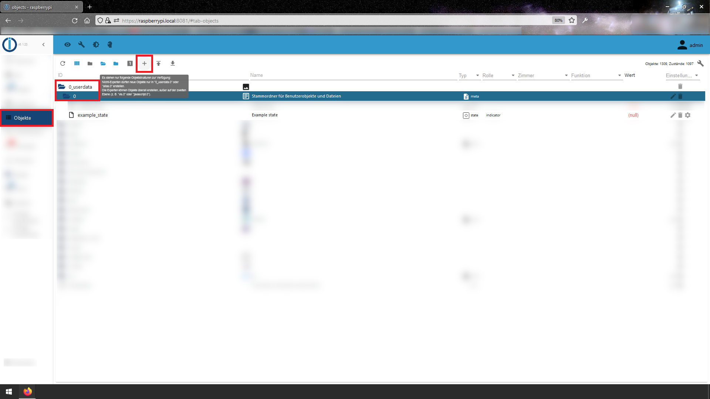

# ioBroker.discord_bot

<!--

**Tests:** 
-->

## Discord adapter for ioBroker

This adapter sends Messages to a Discord Channel using your own Bot.

Discord is a lot more easy to use than a WhatsApp-Bot (no phone number necessary) and saver than Telegram.

The following setup takes under 5 minutes and is completely free.

### Setup:

If you have none, than first of all you'll need an Account at [Discord](https://discord.com) and log in with it.

---

#### creating a new Channel, getting your Channel-ID:

When logged into your Account, create a new Channel. In this example we will name it "house":
1. Hit the "plus" Button:
   

2. Create your own new server:

3. ...for you and your friends:

4. ...and give it a name (e.g. house):

If this worked and you are in the Channel, the URL of your Browser contains your cache-ID which is the first thing you'll need.
It looks something like this: _https://discord.com/channels/xxxxxxxxxxxxxxxxxx/876543210987654321_

From this you need the last URL-Part, in this example it's __876543210987654321__

That's the __Channel-ID__ needed for this Adapter.

---

#### creating a new Bot, getting your Bot-Token:

When logged into Discord, open the [Developer Portal](https://discord.com/developers/applications).

To get a Bot we need a new "Application":
1. Hit the "New Application" Button:

2. give your Apllication a name (e.g. "HouseBot")

3. go to the "Bot"-Tab and hit "Add Bot"

4. ...confirm it

5. From here you can get your Bot-Token

That's the __Bot-Token__ needed for this Adapter.

#### sending Messages from ioBroker

While creating an instance of this adapter comes an object with which messages can be sent.

If you want to use another object, here's a discription of how it's done:

With your channel-ID and your Bot-Token you now just need to choose a ioBroker state.

Messages written into it will be sent to your Discord Channel via your newly created Bot.

For example, we will create a new state inside your userdata-Folder:

1. in your ioBroker, go to Objects, select e.g. the Folder "0_userdata" and the sub-Folder "0" and hit the "plus" Button:

2. the new Object is of type "state", and the value will be of type "string". Give it a name and save it

Your new state now has the full adress __0_userdata.0.discord_message__.

That's your __state__-name which is the last thing this adapter needs.

Whenever the content of this state changes, your Bot will send this into your Discord Channel.

#### finaly

Enter these 3 things, __Channel-ID__, __Bot-Token__ and __state__ (if not default) in the new instance of this adapter and you are ready to go.

Everyone following your Channel will receive the Bot-Messages.

To receive these messages, get [Discord](https://discord.com/download) either for [Windows](https://discord.com/api/downloads/distributions/app/installers/latest?channel=stable&platform=win&arch=x86),
[Mac](https://discord.com/api/download?platform=osx),
[Android](https://discordapp.page.link/?link=https%3A%2F%2Fplay.google.com%2Fstore%2Fapps%2Fdetails%3Fid%3Dcom.discord%26attemptId%3De4dc7dbf-5555-4257-b8ac-71fd09945649&utm_source=download&apn=com.discord&isi=985746746&ibi=com.hammerandchisel.discord&sd=Your%20place%20to%20talk%20with%20communities%20and%20friends.&efr=1),
or [iOS](https://discordapp.page.link/?link=https%3A%2F%2Fplay.google.com%2Fstore%2Fapps%2Fdetails%3Fid%3Dcom.discord%26attemptId%3De4dc7dbf-5555-4257-b8ac-71fd09945649&utm_source=download&apn=com.discord&isi=985746746&ibi=com.hammerandchisel.discord&sd=Your%20place%20to%20talk%20with%20communities%20and%20friends.&efr=1).

### **WORK IN PROGRESS**
* initial release, automated testing still missing

## License
The MIT License (MIT)

Copyright (c) 2014-2019, AB

Permission is hereby granted, free of charge, to any person obtaining a copy of this software and associated documentation files (the "Software"), to deal in the Software without restriction, including without limitation the rights to use, copy, modify, merge, publish, distribute, sublicense, and/or sell copies of the Software, and to permit persons to whom the Software is furnished to do so, subject to the following conditions:

The above copyright notice and this permission notice shall be included in all copies or substantial portions of the Software.

THE SOFTWARE IS PROVIDED "AS IS", WITHOUT WARRANTY OF ANY KIND, EXPRESS OR IMPLIED, INCLUDING BUT NOT LIMITED TO THE WARRANTIES OF MERCHANTABILITY, FITNESS FOR A PARTICULAR PURPOSE AND NONINFRINGEMENT. IN NO EVENT SHALL THE AUTHORS OR COPYRIGHT HOLDERS BE LIABLE FOR ANY CLAIM, DAMAGES OR OTHER LIABILITY, WHETHER IN AN ACTION OF CONTRACT, TORT OR OTHERWISE, ARISING FROM, OUT OF OR IN CONNECTION WITH THE SOFTWARE OR THE USE OR OTHER DEALINGS IN THE SOFTWARE.
